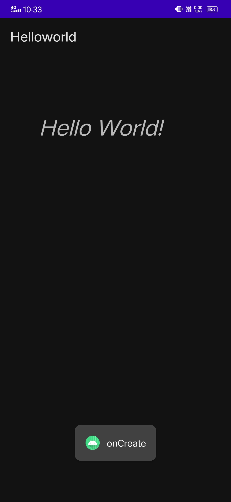
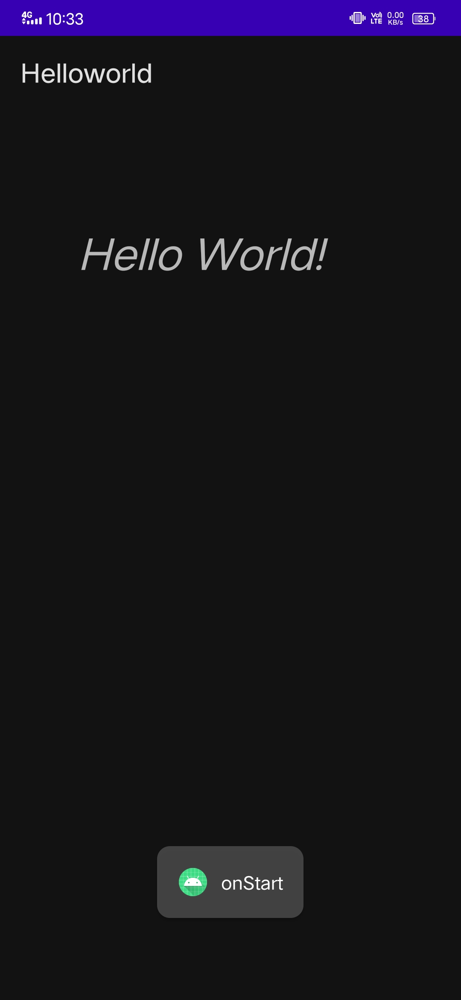

# Ex.No:1 To create a HelloWorld Activity using all lifecycles methods to display messages.

## AIM:

To create a HelloWorld Activity using all lifecycles methods to display messages using Android Studio.

## EQUIPMENTS REQUIRED:

Latest Version Android Studio

## ALGORITHM:

Step 1: Open Android Stdio and then click on File -> New -> New project.

Step 2: Then type the Application name as HelloWorld and click Next. 

Step 3: Then select the Minimum SDK as shown below and click Next.
A
Step 4: Then select the Empty Activity and click Next. Finally click Finish.

Step 5: Design layout in activity_main.xml.

Step 6: Display message give in MainActivity file.

Step 7: Save and run the application.

## PROGRAM:

Program to print the text “Hello World”.

Developed by : Aadhithya Raj V

Registration Number : 212221220001

## activity_main.xml :

<?xml version="1.0" encoding="utf-8"?>
<androidx.constraintlayout.widget.ConstraintLayout xmlns:android="http://schemas.android.com/apk/res/android"
    xmlns:app="http://schemas.android.com/apk/res-auto"
    xmlns:tools="http://schemas.android.com/tools"
    android:layout_width="match_parent"
    android:layout_height="match_parent"
    tools:context=".MainActivity">

    <TextView
        android:id="@+id/head"
        android:layout_width="wrap_content"
        android:layout_height="wrap_content"
        android:fontFamily="@font/arbutus_slab"
        android:text="Mobile Application Development"
        android:textColor="@color/Maroon"
        android:textSize="20sp"
        app:layout_constraintBottom_toTopOf="@+id/body"
        app:layout_constraintEnd_toEndOf="parent"
        app:layout_constraintStart_toStartOf="parent"
        app:layout_constraintTop_toTopOf="parent" />

    <TextView
        android:id="@+id/body"
        android:layout_width="wrap_content"
        android:layout_height="wrap_content"
        android:layout_marginBottom="356dp"
        android:fontFamily="@font/expletus_sans_medium"
        android:text="HELLO WORLD"
        android:textColor="@color/MediumTurquoise"
        android:textSize="20sp"
        app:layout_constraintBottom_toBottomOf="parent"
        app:layout_constraintEnd_toEndOf="parent"
        app:layout_constraintHorizontal_bias="0.498"
        app:layout_constraintStart_toStartOf="parent" />
</androidx.constraintlayout.widget.ConstraintLayout>

## Main_Activity.java : 

package com.example.experiment1;

import androidx.appcompat.app.AppCompatActivity;

import android.os.Bundle;
import android.widget.Toast;

public class MainActivity extends AppCompatActivity {

    @Override
    protected void onCreate(Bundle savedInstanceState) {
        super.onCreate(savedInstanceState);
        setContentView(R.layout.activity_main);
        Toast t = Toast.makeText(getApplicationContext(),"onCreate Called",Toast.LENGTH_LONG);
        t.show();
    }

    protected void onStart(){
        super.onStart();
        Toast t = Toast.makeText(getApplicationContext(),"onStart Called",Toast.LENGTH_LONG);
        t.show();
    }

    protected void onRestart(){
        super.onRestart();
        Toast t = Toast.makeText(getApplicationContext(),"onRestart Called",Toast.LENGTH_LONG);
        t.show();
    }

    protected void onPause(){
        super.onPause();
        Toast t = Toast.makeText(getApplicationContext(),"onPause Called",Toast.LENGTH_LONG);
        t.show();
    }

    protected void onResume(){
        super.onResume();
        Toast t = Toast.makeText(getApplicationContext(),"onResume Called",Toast.LENGTH_LONG);
        t.show();
    }

    protected void onStop(){
        super.onStop();
        Toast t = Toast.makeText(getApplicationContext(),"onStop Called",Toast.LENGTH_LONG);
        t.show();
    }

    protected void onDestroy(){
        super.onDestroy();
        Toast t = Toast.makeText(getApplicationContext(),"onDestroy Called",Toast.LENGTH_LONG);
        t.show();
    }
}

## OUTPUT

## RESULT
Thus a Simple Android Application create a HelloWorld Activity using all lifecycles methods to display messages using Android Studio is developed and executed successfully.
